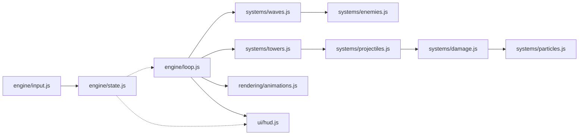
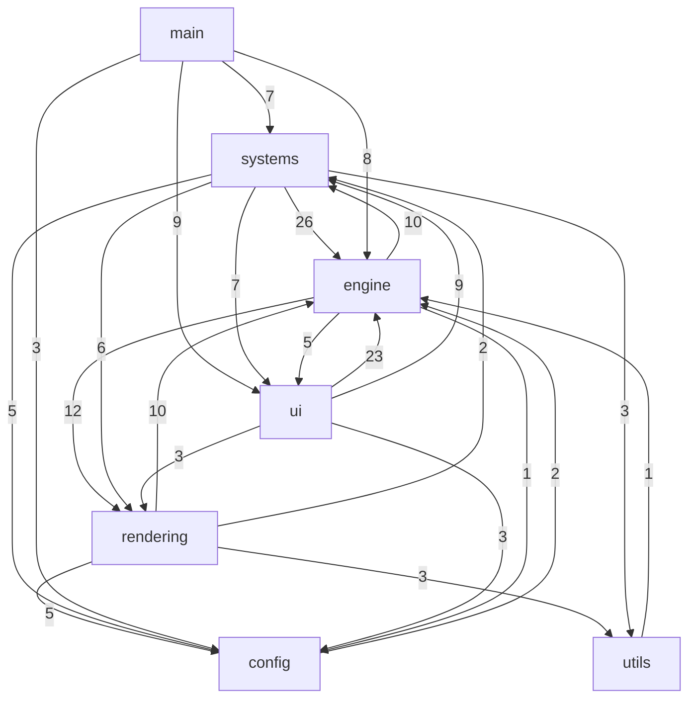

# Codebase Map

A dual-theme 3D tower defense game: vanilla ES modules, Three.js r128 from a CDN,
Vite for dev/build, Vitest for tests. No framework, no bundled dependencies,
**no binary assets** — see [[Asset Index]].

**66 modules · 19625 lines**

| Layer | Modules | Lines |
|---|---|---|
| [[Layer - Root]] | 1 | 313 |
| [[Layer - Config]] | 9 | 2141 |
| [[Layer - Engine]] | 13 | 5418 |
| [[Layer - Rendering]] | 11 | 3886 |
| [[Layer - Systems]] | 14 | 4771 |
| [[Layer - Ui]] | 14 | 2852 |
| [[Layer - Utils]] | 4 | 244 |

## How a frame runs

`engine/loop.js` is a fixed-timestep accumulator. Every system update is called
from it; nothing schedules itself with `setTimeout`.

## Actual layer dependencies

Edge labels are import counts. Note the arrows going *both* ways between
`engine`, `rendering`, `systems` and `ui` — the nominal layering does not hold.

## Hub modules

`engine/state.js` is the de facto root of the whole program: it imports only
`events.js`, and nearly everything else imports it.

| Module | Imported by | Imports |
|---|---|---|
| [[engine-state\|engine/state.js]] | 37 | 1 |
| [[engine-events\|engine/events.js]] | 18 | 0 |
| [[engine-camera\|engine/camera.js]] | 10 | 1 |
| [[ui-hud\|ui/hud.js]] | 9 | 8 |
| [[config-visual-profiles\|config/visual-profiles.js]] | 8 | 0 |
| [[engine-audio\|engine/audio.js]] | 8 | 0 |
| [[systems-pathfinding\|systems/pathfinding.js]] | 8 | 2 |
| [[engine-postprocessing\|engine/postprocessing.js]] | 7 | 0 |
| [[systems-particles\|systems/particles.js]] | 7 | 2 |
| [[ui-upgrade-sheet\|ui/upgrade-sheet.js]] | 7 | 8 |
| [[rendering-quality\|rendering/quality.js]] | 6 | 1 |
| [[systems-storage\|systems/storage.js]] | 6 | 0 |

## Leaf modules

19 modules import nothing local and are safe to reason about in isolation:

[[config-enemies|config/enemies.js]] · [[config-level-layouts|config/level-layouts.js]] · [[config-maps|config/maps.js]] · [[config-towers|config/towers.js]] · [[config-visual-profiles|config/visual-profiles.js]] · [[engine-audio|engine/audio.js]] · [[engine-events|engine/events.js]] · [[engine-pools|engine/pools.js]] · [[engine-postprocessing|engine/postprocessing.js]] · [[systems-auto-wave|systems/auto-wave.js]] · [[systems-highscores|systems/highscores.js]] · [[systems-storage|systems/storage.js]] · [[ui-minimap-draw|ui/minimap-draw.js]] · [[ui-tooltips|ui/tooltips.js]] · [[ui-transitions|ui/transitions.js]] · [[ui-upgrade-path|ui/upgrade-path.js]] · [[utils-assertions|utils/assertions.js]] · [[utils-device|utils/device.js]] · [[utils-math|utils/math.js]]

## Modules nothing imports

- [[systems-highscores|systems/highscores.js]]

See [[Findings]] for what these are and whether they matter.

## Links

- [[Asset Index]] — the data these modules consume
- [[Findings]] — discrepancies found while mapping
- [[Home]]
